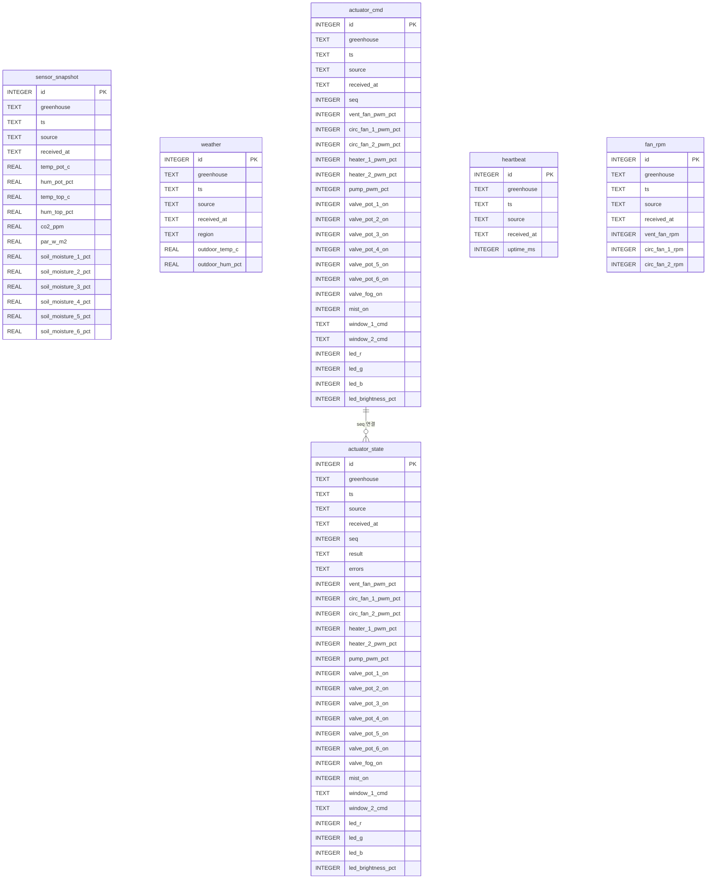

<!-- File: docs/db-schema.md -->
# Database Schema

이 문서는 Raspberry Pi 5에서 사용하는 SQLite 데이터베이스의 테이블 설계를 정의합니다.
logger 서비스가 MQTT 메시지를 수신하여 각 테이블에 저장하고, UI는 이 DB를 조회합니다.

## 1. 설계 원칙

- **DB 엔진**: SQLite 3
- **온실 구분**: 모든 테이블에 `greenhouse` 컬럼(`TEXT`, 값: `gh1` 또는 `gh2`)을 둠
  - 두 온실이 독립적인 Raspberry Pi에서 동작하므로, 각 Pi에는 자기 온실 데이터만 저장됨
  - 그러나 향후 통합/백업을 위해 `greenhouse` 컬럼을 유지
- **타임스탬프**: ISO 8601 형식 (`YYYY-MM-DDTHH:MM:SS+09:00`)
- **네이밍**: `lower_snake_case` (기존 naming-conventions.md와 동일)
- **테이블 1개 = MQTT 토픽 1개** 원칙

## 2. 테이블 목록

| 테이블 | 대응 MQTT 토픽 | 설명 |
| --- | --- | --- |
| `sensor_snapshot` | `sf/<gh>/sensors/snapshot` | 센서 12채널 스냅샷 |
| `weather` | `sf/<gh>/sensors/weather` | KMA 외기 정보 |
| `actuator_cmd` | `sf/<gh>/actuators/cmd` | 액추에이터 제어 명령 |
| `actuator_state` | `sf/<gh>/actuators/state` | 액추에이터 실적용 상태 |
| `heartbeat` | `sf/<gh>/actuators/heartbeat` | Arduino 생존 신호 |
| `fan_rpm` | `sf/<gh>/actuators/fan-rpm` | 팬 RPM 3채널 |

## 3. 테이블 정의

### 3.1 sensor_snapshot

센서 스냅샷 데이터. Raspberry Pi의 ADS1115로 수집한 12채널.

```sql
CREATE TABLE IF NOT EXISTS sensor_snapshot (
    id              INTEGER PRIMARY KEY AUTOINCREMENT,
    greenhouse      TEXT    NOT NULL,  -- 'gh1' | 'gh2'
    ts              TEXT    NOT NULL,  -- ISO 8601
    source          TEXT,              -- e.g. 'rpi5_main'
    received_at     TEXT    NOT NULL DEFAULT (strftime('%Y-%m-%dT%H:%M:%f+09:00', 'now', '+9 hours')),

    temp_pot_c              REAL,
    hum_pot_pct             REAL,
    temp_top_c              REAL,
    hum_top_pct             REAL,
    co2_ppm                 REAL,
    par_w_m2                REAL,
    soil_moisture_1_pct     REAL,
    soil_moisture_2_pct     REAL,
    soil_moisture_3_pct     REAL,
    soil_moisture_4_pct     REAL,
    soil_moisture_5_pct     REAL,
    soil_moisture_6_pct     REAL
);
```

### 3.2 weather

KMA API에서 가져온 외기 정보.

```sql
CREATE TABLE IF NOT EXISTS weather (
    id              INTEGER PRIMARY KEY AUTOINCREMENT,
    greenhouse      TEXT    NOT NULL,
    ts              TEXT    NOT NULL,
    source          TEXT,              -- e.g. 'weather_service'
    received_at     TEXT    NOT NULL DEFAULT (strftime('%Y-%m-%dT%H:%M:%f+09:00', 'now', '+9 hours')),

    region              TEXT,
    outdoor_temp_c      REAL,
    outdoor_hum_pct     REAL
);
```

### 3.3 actuator_cmd

UI 또는 상위 제어 로직이 발행한 액추에이터 명령 기록.

```sql
CREATE TABLE IF NOT EXISTS actuator_cmd (
    id              INTEGER PRIMARY KEY AUTOINCREMENT,
    greenhouse      TEXT    NOT NULL,
    ts              TEXT    NOT NULL,
    source          TEXT,              -- e.g. 'ui'
    received_at     TEXT    NOT NULL DEFAULT (strftime('%Y-%m-%dT%H:%M:%f+09:00', 'now', '+9 hours')),
    seq             INTEGER,

    -- PWM 제어 (0..100)
    vent_fan_pwm_pct        INTEGER,
    circ_fan_1_pwm_pct      INTEGER,
    circ_fan_2_pwm_pct      INTEGER,
    heater_1_pwm_pct        INTEGER,
    heater_2_pwm_pct        INTEGER,
    pump_pwm_pct            INTEGER,

    -- ON/OFF 제어
    valve_pot_1_on      INTEGER,  -- 0 | 1 (SQLite에는 BOOLEAN 없음)
    valve_pot_2_on      INTEGER,
    valve_pot_3_on      INTEGER,
    valve_pot_4_on      INTEGER,
    valve_pot_5_on      INTEGER,
    valve_pot_6_on      INTEGER,
    valve_fog_on        INTEGER,
    mist_on             INTEGER,

    -- 창문 제어
    window_1_cmd    TEXT,  -- 'open' | 'close' | 'stop'
    window_2_cmd    TEXT,

    -- LED 제어
    led_r               INTEGER,  -- 0..255
    led_g               INTEGER,
    led_b               INTEGER,
    led_brightness_pct  INTEGER   -- 0..100
);
```

### 3.4 actuator_state

Arduino가 명령 적용 후 publish한 실제 상태.

```sql
CREATE TABLE IF NOT EXISTS actuator_state (
    id              INTEGER PRIMARY KEY AUTOINCREMENT,
    greenhouse      TEXT    NOT NULL,
    ts              TEXT    NOT NULL,
    source          TEXT,              -- e.g. 'arduino_ctrl'
    received_at     TEXT    NOT NULL DEFAULT (strftime('%Y-%m-%dT%H:%M:%f+09:00', 'now', '+9 hours')),
    seq             INTEGER,
    result          TEXT,              -- e.g. 'ok'
    errors          TEXT,              -- JSON array as text, e.g. '[]'

    -- applied 상태값 (actuator_cmd와 동일 구조)
    vent_fan_pwm_pct        INTEGER,
    circ_fan_1_pwm_pct      INTEGER,
    circ_fan_2_pwm_pct      INTEGER,
    heater_1_pwm_pct        INTEGER,
    heater_2_pwm_pct        INTEGER,
    pump_pwm_pct            INTEGER,

    valve_pot_1_on      INTEGER,
    valve_pot_2_on      INTEGER,
    valve_pot_3_on      INTEGER,
    valve_pot_4_on      INTEGER,
    valve_pot_5_on      INTEGER,
    valve_pot_6_on      INTEGER,
    valve_fog_on        INTEGER,
    mist_on             INTEGER,

    window_1_cmd    TEXT,
    window_2_cmd    TEXT,

    led_r               INTEGER,
    led_g               INTEGER,
    led_b               INTEGER,
    led_brightness_pct  INTEGER
);
```

### 3.5 heartbeat

Arduino 생존 신호 기록.

```sql
CREATE TABLE IF NOT EXISTS heartbeat (
    id              INTEGER PRIMARY KEY AUTOINCREMENT,
    greenhouse      TEXT    NOT NULL,
    ts              TEXT    NOT NULL,
    source          TEXT,              -- e.g. 'arduino_ctrl'
    received_at     TEXT    NOT NULL DEFAULT (strftime('%Y-%m-%dT%H:%M:%f+09:00', 'now', '+9 hours')),

    uptime_ms       INTEGER
);
```

### 3.6 fan_rpm

팬 RPM 측정값 기록.

```sql
CREATE TABLE IF NOT EXISTS fan_rpm (
    id              INTEGER PRIMARY KEY AUTOINCREMENT,
    greenhouse      TEXT    NOT NULL,
    ts              TEXT    NOT NULL,
    source          TEXT,              -- e.g. 'arduino_ctrl'
    received_at     TEXT    NOT NULL DEFAULT (strftime('%Y-%m-%dT%H:%M:%f+09:00', 'now', '+9 hours')),

    vent_fan_rpm        INTEGER,
    circ_fan_1_rpm      INTEGER,
    circ_fan_2_rpm      INTEGER
);
```

## 4. 인덱스

조회 성능을 위한 인덱스.

```sql
-- sensor_snapshot: 시계열 조회용
CREATE INDEX IF NOT EXISTS idx_sensor_snapshot_gh_ts
    ON sensor_snapshot (greenhouse, ts);

-- weather: 시계열 조회용
CREATE INDEX IF NOT EXISTS idx_weather_gh_ts
    ON weather (greenhouse, ts);

-- actuator_state: 시계열 조회용
CREATE INDEX IF NOT EXISTS idx_actuator_state_gh_ts
    ON actuator_state (greenhouse, ts);

-- heartbeat: 최신 상태 조회용
CREATE INDEX IF NOT EXISTS idx_heartbeat_gh_ts
    ON heartbeat (greenhouse, ts);

-- fan_rpm: 시계열 조회용
CREATE INDEX IF NOT EXISTS idx_fan_rpm_gh_ts
    ON fan_rpm (greenhouse, ts);

-- actuator_cmd: 이력 조회용
CREATE INDEX IF NOT EXISTS idx_actuator_cmd_gh_ts
    ON actuator_cmd (greenhouse, ts);
```

## 5. 뷰 (Views)

UI에서 최신값 조회를 간편하게 하기 위한 뷰.

### 5.1 latest_sensor_snapshot

```sql
CREATE VIEW IF NOT EXISTS latest_sensor_snapshot AS
SELECT *
FROM sensor_snapshot
WHERE id = (
    SELECT id FROM sensor_snapshot
    WHERE greenhouse = sensor_snapshot.greenhouse
    ORDER BY ts DESC
    LIMIT 1
);
```

### 5.2 latest_weather

```sql
CREATE VIEW IF NOT EXISTS latest_weather AS
SELECT *
FROM weather
WHERE id = (
    SELECT id FROM weather
    WHERE greenhouse = weather.greenhouse
    ORDER BY ts DESC
    LIMIT 1
);
```

### 5.3 latest_actuator_state

```sql
CREATE VIEW IF NOT EXISTS latest_actuator_state AS
SELECT *
FROM actuator_state
WHERE id = (
    SELECT id FROM actuator_state
    WHERE greenhouse = actuator_state.greenhouse
    ORDER BY ts DESC
    LIMIT 1
);
```

### 5.4 latest_heartbeat

```sql
CREATE VIEW IF NOT EXISTS latest_heartbeat AS
SELECT *
FROM heartbeat
WHERE id = (
    SELECT id FROM heartbeat
    WHERE greenhouse = heartbeat.greenhouse
    ORDER BY ts DESC
    LIMIT 1
);
```

### 5.5 latest_fan_rpm

```sql
CREATE VIEW IF NOT EXISTS latest_fan_rpm AS
SELECT *
FROM fan_rpm
WHERE id = (
    SELECT id FROM fan_rpm
    WHERE greenhouse = fan_rpm.greenhouse
    ORDER BY ts DESC
    LIMIT 1
);
```

## 6. ER Diagram



## 7. 데이터 보존 정책 (권장)

시계열 데이터가 계속 쌓이므로 주기적 정리를 권장합니다.

| 테이블 | 권장 보존 기간 | 비고 |
| --- | --- | --- |
| `sensor_snapshot` | 90일 | 과거 추세 탭에서 사용 |
| `weather` | 90일 | 과거 추세 탭에서 사용 |
| `actuator_cmd` | 30일 | 디버깅/감사용 |
| `actuator_state` | 30일 | 디버깅/감사용 |
| `heartbeat` | 7일 | 온라인 여부 판단용 |
| `fan_rpm` | 30일 | 모니터링용 |

정리 방법 예시:
```sql
-- 90일 이전 sensor_snapshot 삭제
DELETE FROM sensor_snapshot
WHERE ts < strftime('%Y-%m-%dT%H:%M:%S+09:00', 'now', '+9 hours', '-90 days');
```

## 8. 사용 시나리오

### 8.1 실시간 모니터링 탭
- `latest_sensor_snapshot` 뷰에서 최신 센서값 조회
- `latest_weather` 뷰에서 최신 외기 정보 조회
- `latest_heartbeat` 뷰에서 Arduino online/offline 판단

### 8.2 액추에이터 제어 탭
- `latest_actuator_state` 뷰에서 현재 적용 상태 표시
- `latest_fan_rpm` 뷰에서 현재 RPM 표시
- 제어 명령은 MQTT publish 후 `actuator_cmd`에 기록

### 8.3 과거 추세 탭
- `sensor_snapshot` 테이블에서 기간 필터 쿼리
- `weather` 테이블에서 외기 데이터 조인

```sql
-- 예: 최근 24시간 온도 추세 조회
SELECT ts, temp_pot_c, temp_top_c
FROM sensor_snapshot
WHERE greenhouse = 'gh1'
  AND ts >= strftime('%Y-%m-%dT%H:%M:%S+09:00', 'now', '+9 hours', '-1 day')
ORDER BY ts;
```

## 9. TODO
- [ ] `received_at` 기본값의 타임존 처리 방식 확정
- [ ] 데이터 보존 정책 최종 확정
- [ ] logger 서비스의 부분 업데이트(partial update) 저장 방식 확정
  - cmd 메시지에 일부 키만 포함될 수 있으므로, NULL 허용으로 처리
- [ ] VACUUM 주기 결정
- [ ] DB 파일 경로 및 백업 전략 확정
